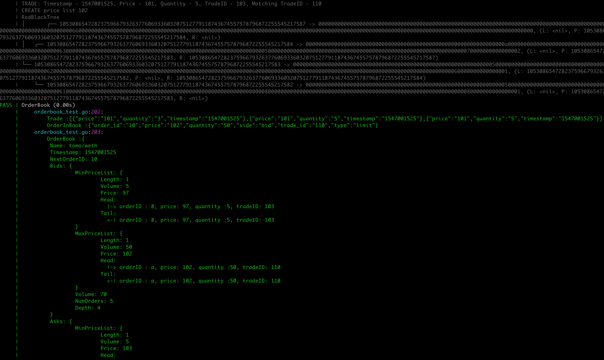

## Orderbook built in LevelDB

#### Usage

```go
orderBook := NewOrderBook(pairName, testDB)

//Submitting a limit order that crosses the opposing best price will result in a trade
marketOrder := make(map[string]string)
marketOrder["type"] = "limit"
marketOrder["side"] = Bid
marketOrder["quantity"] = "2"
marketOrder["price"] = "102"
marketOrder["trade_id"] = "109"

trades, orderInBook = orderBook.ProcessOrder(marketOrder, true)

```

**The result:**


